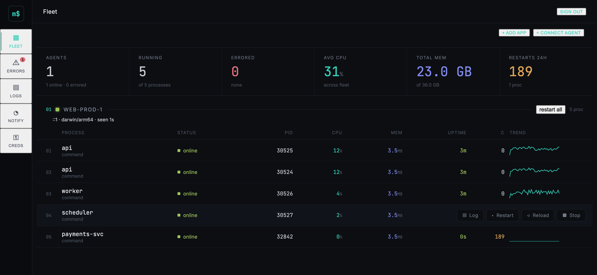
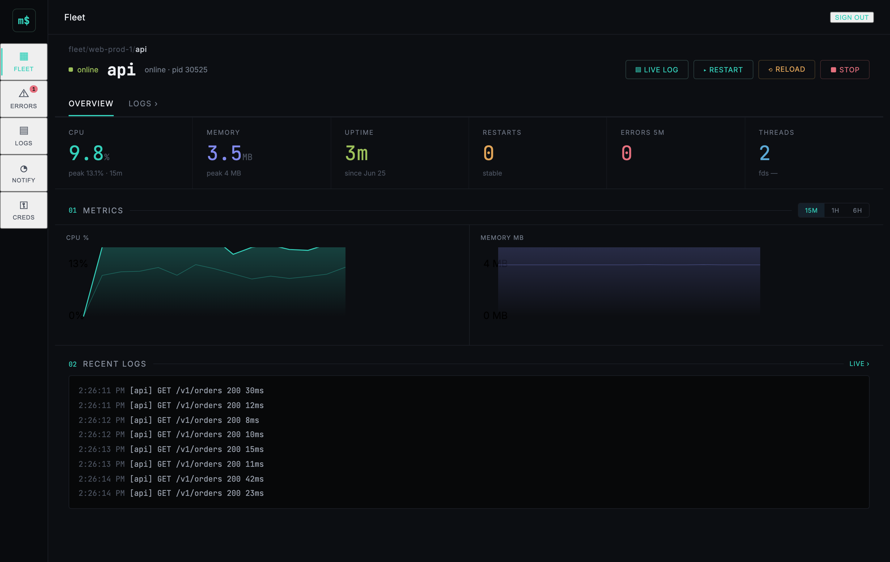
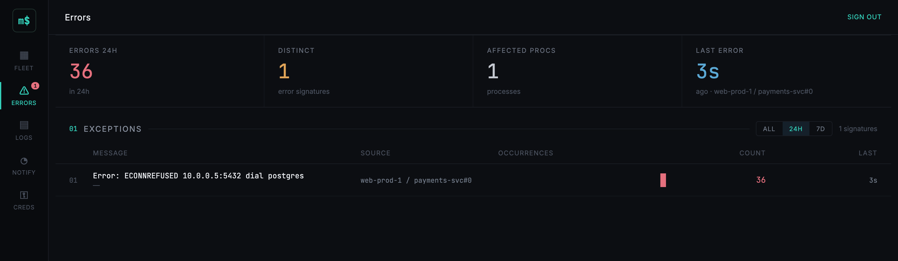
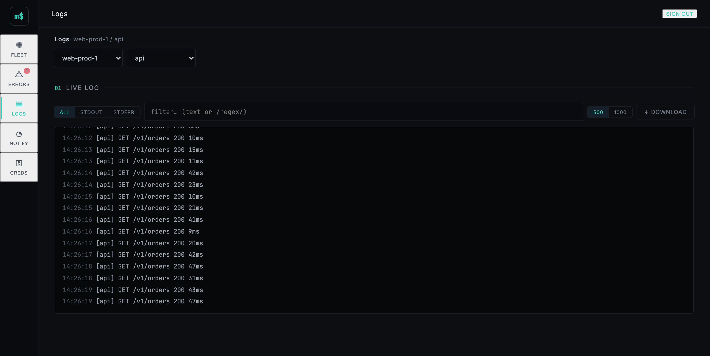

# Marshal

**A free, self-hosted process manager and fleet supervisor — an open alternative to [PM2](https://pm2.keymetrics.io/) and the paywalled PM2 Plus insights.**

Marshal supervises any kind of OS process (not just Node) — keeps it alive with restart
policies and backoff, captures its logs and CPU/memory metrics, and — across many hosts —
aggregates everything into a single authenticated web dashboard. It can even deploy your
apps straight from a git repo and let you edit their files in the browser.

Written in Go, standard-library-leaning, built bottom-up from a single-host supervisor into
a full fleet manager.



> [!IMPORTANT]
> ### 🤖 Vibecoded with Claude Code
> **Every line of this project — code, tests, design specs, and these docs — was written by
> [Claude Code](https://claude.com/claude-code)** (Anthropic's agentic coding tool), driven
> milestone-by-milestone through a brainstorm → spec → plan → test-driven-development →
> code-review → live-demo loop. A human steered direction and approved each step; the
> implementation is the model's.
>
> It is a genuine, working, test-covered codebase — but treat it accordingly: **review it
> yourself before trusting it with anything important.** See [Provenance](#-provenance) below.

---

## Features

**Process supervision**
- Declarative `marshal.yaml`: apps with command, args, env, working dir.
- Restart policies (`always` / `on-failure` / `no`) with exponential backoff and a max-restart cap.
- N fork-mode instances per app (each gets a `MARSHAL_INSTANCE_ID`).
- Each app runs in its own **process group**, so stopping it tears down the whole child tree — no orphans.

**Daemon + CLI**
- Background daemon with a `marshal` control CLI over a Unix-socket gRPC link.
- `start` / `stop` / `restart` / `list` / `describe` / `delete` / `logs` / `metrics`.
- `save` / `resurrect` — persist the managed app list to `dump.json` and restore it.
- Boot integration: `marshal startup` installs a launchd/systemd service.

**Logs & metrics**
- stdout/stderr capture to rotated per-app log files, with history and live tailing.
- CPU and memory sampling with stored history.
- Full-text log search.

**Fleet (multi-host)**
- Lightweight agents on each host connect to a central server over **fingerprint-pinned TLS** (token-enrolled).
- The server aggregates live process state, metrics, and logs across the whole fleet.

**Web dashboard** (`https://<server>:<http-port>`)
- Live process cards across all agents, CPU/memory charts, live log tailing + search.
- Process controls (start/stop/restart/delete) per instance.
- Password auth with bcrypt, server-side sessions + invalidation, a login audit log, rate limiting, and TLS.

**Git deploy & in-browser editing**
- Deploy an app straight from a **git repository** (clone → build → launch); redeploy pulls the latest commit.
- **Managed credentials**, stored encrypted at rest (AES-256-GCM) and pushed to the agent only per-operation:
  - **HTTPS personal-access tokens** (injected via `GIT_ASKPASS`, never in argv/URL/logs).
  - **SSH deploy keys** — Marshal generates an ed25519 keypair, shows you the public key to register,
    and pins the git host's SSH key on first use (`ssh-keyscan` TOFU) so the agent verifies it strictly thereafter.
- **In-browser file browser + editor**: read, edit, create, rename, and delete a deployed app's files;
  each change is its own commit, pushed back to origin.

---

## Architecture

```
   host A                 host B                 host C
 ┌─────────┐            ┌─────────┐            ┌─────────┐
 │ marshal │            │ marshal │            │ marshal │     per-host agent:
 │  agent  │            │  agent  │            │  agent  │     supervises processes,
 └────┬────┘            └────┬────┘            └────┬────┘     captures logs/metrics
      │   fingerprint-pinned │  TLS                 │
      └──────────────────────┼──────────────────────┘
                             ▼
                      ┌──────────────┐
                      │   marshal    │   central server: aggregates fleet
                      │    server    │   state, stores metrics/logs,
                      └──────┬───────┘   serves the dashboard
                             ▼
                      ┌──────────────┐
                      │ web dashboard│   authenticated UI (React)
                      └──────────────┘
```

A single host can also just run the agent + CLI with no server at all.

---

## Dashboard

The dashboard is a React app **embedded in the binary** — no separate web server to run. It's
served over TLS at `https://<server>:<http-port>` behind password auth.

**Process detail** — current gauges, CPU/memory history, and live logs per process:



**Errors** — stderr is normalized into grouped exception signatures with occurrence counts and trends:



**Live logs** — stream stdout/stderr across the fleet with level and text/regex filtering:



---

## Install

Marshal ships as a single, self-contained binary (the dashboard is embedded; no runtime
dependencies). Pre-1.0 — expect rough edges.

**Homebrew** (macOS / Linux):

```bash
brew install REDDE4D/tap/marshal
```

**Install script** (downloads the latest release binary, verifies its checksum):

```bash
curl -fsSL https://raw.githubusercontent.com/REDDE4D/marshal-pm/main/install.sh | sh
```

**Debian / RPM** — `.deb` and `.rpm` packages are attached to each
[release](https://github.com/REDDE4D/marshal-pm/releases); they install the binary, shell
completions, and a (disabled-by-default) `marshal.service`:

```bash
sudo dpkg -i marshal_*_linux_amd64.deb     # or: sudo rpm -i marshal_*_linux_amd64.rpm
sudo systemctl enable --now marshal        # optional: run the daemon as a service
```

**Docker** — the central **fleet server + dashboard** (not the per-host agent) ships as a
container:

```bash
docker run -p 9000:9000 -p 9001:9001 -v marshal-data:/data ghcr.io/redde4d/marshal:latest
```

**Go** (requires the Go toolchain):

```bash
go install github.com/REDDE4D/marshal-pm/cmd/marshal@latest
```

Or grab a prebuilt archive for your OS/arch from the
[releases page](https://github.com/REDDE4D/marshal-pm/releases), or build from source with
`make build` (stamps the version from git tags).

Supported platforms: linux and macOS, amd64 and arm64. (Windows is not supported — Marshal
relies on unix process groups and service managers.)

## Quick start (single host)

```bash
go build -o marshal ./cmd/marshal
```

```yaml
# marshal.yaml
apps:
  - name: api
    cmd: ./server
    args: ["--port", "8080"]
    instances: 2          # fork mode; each instance gets MARSHAL_INSTANCE_ID
    restart: on-failure   # always | on-failure | no
    max_restarts: 16
    kill_timeout: 5s
    env:                  # inline environment (takes precedence over env_file)
      LOG_LEVEL: info
    env_file: .env.api    # dotenv file merged in, relative to this marshal.yaml
```

Several apps can share one script with a separate `env_file` each — the common PM2
ecosystem pattern:

```yaml
apps:
  - { name: aegis, cmd: node, args: ["src/index.js"], env_file: .env.aegis }
  - { name: raven, cmd: node, args: ["src/index.js"], env_file: .env.raven }
  - { name: ghost, cmd: node, args: ["src/index.js"], env_file: .env.ghost }
```

**Migrating from PM2?** Convert an existing ecosystem file in one step:

```bash
marshal import pm2 ecosystem.config.js -o marshal.yaml
```

`.js`/`.cjs` files are evaluated with `node`, so dynamic config (env loaders, spreads) resolves
exactly as PM2 would; `.json`/`.yaml` are read directly. Anything without a Marshal equivalent
(cluster mode, `watch`, `cron_restart`) is reported as a warning.

Add `--split-env` to keep secrets out of the YAML — each app's env is written to a `0600`
`<name>.env` file and referenced via `env_file:` instead of being inlined:

```bash
marshal import pm2 ecosystem.config.js --split-env -o marshal.yaml
```

```bash
./marshal start marshal.yaml     # start under the background daemon
./marshal list                   # see managed processes
./marshal logs api               # tail logs
./marshal metrics api            # CPU/memory history
./marshal stop api               # stop an app
```

Run it in the foreground instead (no daemon), Ctrl-C to stop everything cleanly:

```bash
./marshal run marshal.yaml
```

On shutdown Marshal sends each app `SIGTERM`, waits up to `kill_timeout`, then `SIGKILL`s any
survivors — signaling the whole process group so children are never orphaned.

## Quick start (dashboard, single host)

One command runs the server, the dashboard, and a local agent supervising your apps:

```bash
marshal server passwd                              # set the dashboard password (once)
marshal server --self-enroll marshal.yaml          # server + dashboard + your apps
```

Open `https://localhost:9001`, log in as `admin`, and watch your processes. To run it on
boot (systemd/launchd):

```bash
marshal server startup --self-enroll /path/to/marshal.yaml
```

## Quick start (multi-host fleet)

```bash
# --- on the server host ---
marshal server passwd                       # set the dashboard password (server stopped)
marshal server token --rotate enroll        # mint an agent enroll token
marshal server fingerprint                  # note the TLS cert fingerprint
marshal server --listen :9000 --http-listen :9001

# --- on each agent host: a marshal.yaml with a server: block ---
# server:
#   address: server-host:9000
#   name: web-1
#   token: <enroll-token>
#   fingerprint: <fingerprint>
marshal start marshal.yaml
```

Open `https://<server-host>:9001`, log in, and watch the fleet. To deploy from git, add a
credential under **Credentials**, then **add app** with a git source.

---

## Build / test

```bash
go build -o marshal ./cmd/marshal      # build the CLI/agent/server (one binary)
go test ./...                          # all tests
go test ./... -race -count=1           # race check
go vet ./... && gofmt -l .             # lint / format
make ui                                # rebuild the embedded web dashboard (web/ → internal/dashboard/dist)
```

Requires **Go 1.26+**. The web dashboard is a React/TypeScript app under `web/`, built and
embedded into the binary — no separate web server to run.

## Project layout

| Path | What |
|------|------|
| `cmd/marshal/` | CLI entry point (agent, server, and control commands) |
| `internal/` | the packages: `supervisor`, `proc`, `manager`, `daemon`, `fleet`, `server`, `dashboard`, `credstore`, `deploy`, … |
| `web/` | React dashboard (embedded into the binary at build) |
| `proto/` | gRPC/protobuf definitions for the agent↔server↔CLI surface |
| `docs/` | design specs, implementation plans, and per-milestone handoffs |

---

## 🤖 Provenance

Marshal is an experiment in **agent-built software**: it was developed end-to-end by Claude
Code over a series of milestones (M1 → M25 and counting), each one going through the same
disciplined loop — brainstorm the design, write a spec, write a step-by-step plan, implement
it test-first, get it code-reviewed by a separate agent, then prove it with a real live demo.
The full paper trail lives in [`docs/`](docs/) (specs, plans, and handoffs).

What that means for you:

- ✅ It's real, builds, and has a substantial automated test suite (run `go test ./...`).
- ⚠️ It has **not** had a human security audit. The auth, TLS, and credential-handling code is
  designed carefully and tested, but you should review it before exposing anything to a hostile network.
- ⚠️ APIs and on-disk formats may change between milestones.

Contributions, bug reports, and "the model got this wrong" findings are very welcome.

## Contributing

Found a bug or want a feature? Please open an issue — there are templates to guide you. If
you send a pull request, keep changes focused and include tests where it makes sense (the
project is test-driven).

## License

[GPL-3.0](LICENSE). Marshal is free software: you can redistribute it and/or modify it under
the terms of the GNU General Public License v3. **Derivative works and forks must also remain
open source under the GPL**, and copyright/license notices must be preserved.

Copyright © 2026 Sebastian Kuprat.
